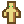
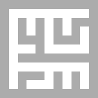

# EMLife

**Made by EiEddie**  
A Simple Maze Game

## 游戏说明

- 使用方向键 `Up` `Down` `Left` `Right` 控制人物
  
  移动.

- 在尽可能短的时间内完成游戏!

- 尽可能多的收集 `Coin`
  .

- 要想获胜, 您必须先获得地图上所有的 `Star`
  .

- 当地图上显示终点
  
  时, 触碰它以获胜.

- 当心坏蛋! `demon`
  
  会使您输掉游戏.

- 要重置游戏记录, 您可以尝试删除 `gameData.db` 文件.

## 自定义

- 更改 `Bin/Img/font.png` 文件以更改字体
  > 位图字体 `font.png` 内必须包括所有ASCII可见字符, 即 `\u0020` ***`(Space)`*** 到 `\u007e` ***`~`***.  
  每个字符大小为16*16, 按ASCII顺序排列, 每十六个字符一行, 共六行, 故 `font.png` 大小 `256px * 96px`.  
  最后一行最后一个留空.

- 更改 `Bin/Img` 文件夹内
  > `wallStr.png`  
  `wallEnd.png`  
  `wallCor.png`  
  `wallTri.png`  
  `wallCros.png`  
  `fge.png`  
  `end.png`  
  `coin.png`  
  `star.png`  
  `demon.png`

  以分别更改下列图标
  > 围墙(直)   
  围墙(弯)   
  围墙(末端)   
  围墙(三岔)   
  围墙(十字)   
  人物   
  终点   
  `coin`   
  `star`   
  `demon` 

_________

## 详解

### 地图生成

对于下图所示任意11*11的迷宫:



白色为路点 `road`, 人物

可以移动; 灰色为墙点 `wall`, 人物

不可移动至其上.

0. **初始化**  
   定义一个全部为 `wall` 的迷宫以开始生成(如下图).  
     
   定义两个容器 `roadPoint` `wallPoint`.  
   将起点 `(1, 1)` 加入容器 `wallPoint`.


1. 随机从 `wallPoint` 中取出一元素 `cd1` (此时 `wallPoint` 中不存在此元素), 在迷宫里将其标记为 `road`.  
   ***当 `wallPoint` 中仅有起点 `(1, 1)` 时的迷宫:***  
   


2. 在 `cd1` 四周随机选择一个存在于 `roadPoint` 中的点: `cd2`, 并将其与 `cd1` 打通.  
   当四周没有符合条件的点则跳过本步骤.  
   ***一种可能的情况(红色为 `cd1`, 蓝色为被选中的 `cd2`):***  
     
   ***打通后:***  
   


3. 将 `cd1` 加入 `roadPoint`.


4. 将 `cd1` 四周相距两格且不在 `wallPoint` 中的 `wall` 加入 `wallPoint`.

重复上述 **1~4** 操作, 直到 `wallPoint` 为空.

### 位图字体

使用 *二次裁剪法* 处理外部位图字体:

#### 第一次裁剪

目的: 将字符逐个自 `font.png` 文件中裁剪为 16*16 的单元

[定义](Src/Draw/gameDrawWord.cpp)

```c++
/*
 * 声明于 GameDrawWord 类中
 */
SDL_Surface *GameDrawWord::CropCharaFirst(SDL_Surface *font, SDL_Rect *cod) {
	
	//被裁剪下来的单个字符
	SDL_Surface *chara = SDL_CreateRGBSurface(
		SDL_SWSURFACE,
		16, 16, 32,
		0xff000000, 0x00ff0000,
		0x0000ff00, 0x000000ff
	);
	SDL_UpperBlit(font, cod, chara, nullptr);
	
	return chara;
}
```

#### 第二次裁剪

目的: 确定字符大小, 并将字符裁剪为贴合其自身尺寸的单元

##### 获取字符大小

1. 逐行遍历字符像素, 第一次发现该点非透明时记录此点纵坐标 `height1` *(图一动点第一次变为黄色时; 或图二).*

2. 最后一次发现该点非透明时记录此点纵坐标 `height2` *(图一动点第一次变为黄色时; 或图三)*

3. **`height2` - `height1` + 1**即为字符高度

***图一: 遍历字符***  


***图二:***  


***图三:***  


同理, 逐列遍历字符像素并依次记录第一次与最后一次发现该点非透明时的横坐标 `width1` `width2`, 两者之差的绝对值加一即为字符宽度.

## 使用的库

> **[SDL](https://www.libsdl.org)**  
知名的跨平台多媒体开发库

> **[SDL_image](https://www.libsdl.org/projects/SDL_image)**  
SDL的附属库, 用于导入除 `.bmp`位图格式之外的其他图片格式