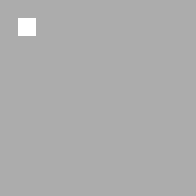

# EMLife

**Made by EiEddie**  
A Simple Maze Game  

## 游戏说明

- 使用方向键 `Up` `Down` `Left` `Right` 控制人物
  
  移动  

- 尽可能多的收集 `Coin`
    

- 要想获胜, 您必须先获得地图上所有的 `Star`
    

- 当地图上显示终点
  
  时, 触碰它以获胜  

- 当心坏蛋! 魔鬼
  
  会使您输掉游戏  

_________

## 详解

### 地图生成

对于下图所示任意11*11的迷宫:  

白色为路点 `road`, 人物

可以移动; 灰色为墙点 `wall`, 人物

不可移动至其上.  

0. **初始化**  
   定义一个全部为 `wall` 的迷宫以开始生成(如下图).  
     
   定义两个容器 `roadPoint` `wallPoint`.  
   将起点 `(1, 1)` 加入容器 `wallPoint`.  

1. 随机从 `wallPoint` 中取出一元素 `cd1` (此时 `wallPoint` 中不存在此元素), 在迷宫里将其标记为 `road`.  
   ***当 `wallPoint` 中仅有起点 `(1, 1)` 时的迷宫:***  
     

2. 在 `cd1` 四周随机选择一个存在于 `roadPoint` 中的点: `cd2`, 并将其与 `cd1` 打通.  
   当四周没有符合条件的点则跳过本步骤.  
   ***一种可能的情况(红色为 `cd1`, 蓝色为被选中的 `cd2`):***  
     
   ***打通后:***  
     

3. 将 `cd1` 加入 `roadPoint`.  

4. 将 `cd1` 四周相距两格且不在 `wallPoint` 中的 `wall` 加入 `wallPoint`.  

重复上述 **1~4** 操作, 直到 `wallPoint` 为空.  